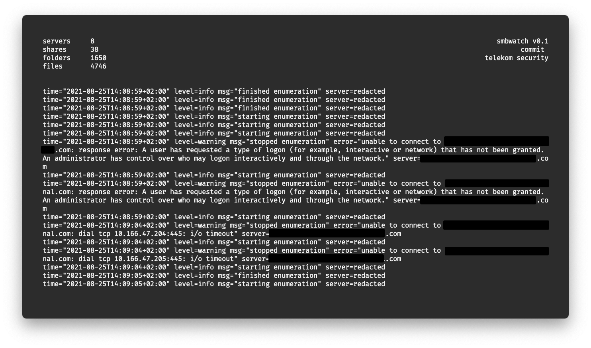

# smbwatch

recursively retrieves all files and folders from an smbshare and persists to a sqlite db.
it is also possible to retrieve the list of servers from LDAP.

Features:

* Query list of all servers from LDAP with `-ldap*`
* or enumerate a single share with `-server`
* Concurrency for fast retrieval, max. one connection per server
* Scans can be resumed
* All shares, folders and files are persisted to sqlite
* Exclude specific shares by name

## Installation and Usage

Clone and build (or downloaded a release):

    $ git clone
    $ make
    
Usage:

    $ ./smbwatch -h
    Usage of smbwatch:
      -dbname string
            sqlite filename (default "sqlite.db")
      -debug
            debug mode
      -excludeShares string
            share names to exclude, separated by a ','
      -ldapDn string
            ldap distinguished name
      -ldapFilter string
            ldap filter to search for shares (default "(OperatingSystem=*server*)")
      -ldapServer string
            ldap server to get smb server list
      -maxdepth int
            max recursion depth when retrieving files (default 3)
      -pass string
            NTLM pass
      -server string
            smb server
      -timeout int
            smb server connect timeout (default 5)
      -user string
            NTLM user
      -worker int
            amount of parallel worker (default 8)
            
To enumerate a single server use the `-server` flag. To get a list of servers from
ldap and enumerate all of them, pass the `-ldap*` arguments.
    
Example:

    $ smbwatch -user A123456 -pass A123456 -ldapServer ldaps://foo.bar.internal.com:636 -ldapDn CN=A123456,OU=Users,OU=DE,DC=foo,DC=bar,DC=internal,DC=com
